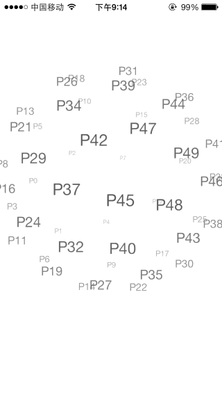

---
abbrlink: 42072
---
### 八、变更记录

| 序号 | 录入时间 | 录入人 | 备注 |
|:--------:|:--------:|:--------:|:--------:|
| 1 | 2016-03-14 | [Alfred Jiang](https://yujiuqie.github.io) | - |

### 一、方案名称

特殊控件 - 使用 DBSphereTagCloud 实现标签云效果

### 二、关键字

特殊控件 \ DBSphereTagCloud

### 三、需求场景

1. 绘制标签云效果时

### 四、参考链接
(见详细内容)

### 五、详细内容

#####1. [GitHub - DBSphereTagCloud](https://github.com/dongxinb/DBSphereTagCloud)

### 六、效果图

### 七、备注
（无）
